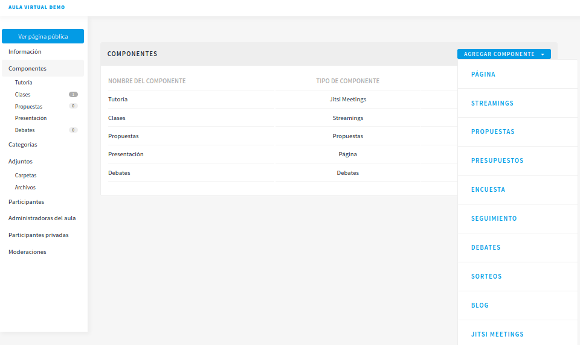
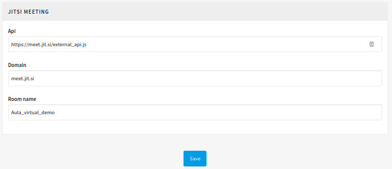

# Decidim::JitsiVideoconference

[](https://codeclimate.com/github/alabs/decidim-module-jitsi-videoconference/test_coverage)
[](https://codeclimate.com/github/alabs/decidim-module-jitsi-videoconference/maintainability)

This module of [Decidim](https://decidim.org/) allows to deploy public or private videoconference rooms of any [jitsi](https://meet.jit.si/) server in participative processes and assemblies.


## Installation

> NOTE: This module is ready to use but in Beta status. Feel free to report any bug! compatible and tested in versions Decidim 0.20 and 0.21.

1.- Add this line to your application's Gemfile:

```ruby
gem 'decidim-jitsi_meetings', git: 'https://github.com/alabs/decidim-module-jitsi-videoconference.git'
```

2.- Run this rake tasks:

```bash
bundle intall
rake decidim_jitsi_meetings:install:migrations
bundle exec rake db:migrate
```

## Usage

JitsiMeetings will be available as a Component for a Participatory Space (participative processes and assemblies)



To configure the module you only need to add three parameters, the server API access url, the jitsi server domain and the room name for the assembly or participatory process:



## Contributing

For instructions how to setup your development environment for Decidim, see [Decidim](https://github.com/decidim/decidim). Also follow Decidim's general instructions for development for this project as well.

## License

This engine is distributed under the GNU AFFERO GENERAL PUBLIC LICENSE.
